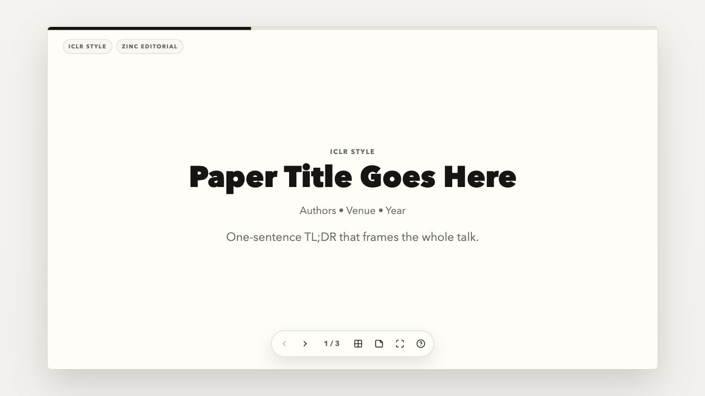

# Slider

Evidence-first research slide generation for conference talks.

Slider turns an arXiv paper, PDF, title, DOI, or extracted text into a browser-native presentation that is faithful to the paper, visually restrained, and ready to audit before delivery.



## Why Slider

Most paper-to-slide workflows produce generic summaries. Slider is built around a stricter product promise: the deck should explain the paper through evidence, not decoration.

- **Evidence-first planning:** extracts claims, methods, results, limitations, figures, and tables before composing slides.
- **Mandatory visual inclusion:** key paper figures and tables are treated as main-deck content, not optional garnish.
- **Paper-type policy:** architecture, optimization, benchmark, theory, and qualitative papers get different deck policies.
- **Research-grade design:** projector-safe typography, density budgets, anti-AI-slop rules, and stable fullscreen rendering.
- **Self-contained output:** the default artifact is one HTML file that opens directly in a browser.
- **Audit-backed delivery:** static, design, evidence, and browser overflow checks are part of the workflow.

## What You Get

Slider can generate or scaffold:

| Output | Use case |
|:---|:---|
| Built HTML deck | Default deliverable. Single self-contained presentation file. |
| React single-file component | Quick integration into an existing React workflow. |
| React project starter | Multi-file Vite project with presenter controls and a fixed 1200x675 stage. |
| Platform configs | Instructions for Gemini, ChatGPT, Claude, Claude Code, and OpenAI agents. |

## Example Product Surface

The bundled React project starter includes a fixed-stage deck shell, keyboard navigation, progress, overview, speaker notes, fullscreen controls, a linked presenter window, blackout controls, and product-quality CSS without relying on implicit global styling.

```bash
cd assets/react-project-starter
npm install
npm run dev
```

Then open the local Vite URL and use:

- `Left` / `Right` or `Space` for slide navigation.
- `O` for overview.
- `N` for speaker notes.
- `C` for review comments.
- `V` for paper visual asset manager.
- `D` for deck design lock.
- `F` for fullscreen.
- `P` for presenter window.
- `L` for laser pointer.
- `B` / `W` for black or white screen.
- Swipe or wheel for slide navigation.
- `?` for keyboard help.

## Pipeline

Slider follows a deterministic, evidence-backed flow:

1. Ingest paper text or PDF.
2. Extract title, authors, claims, method, experiments, limitations, figures, and tables.
3. Classify paper type.
4. Score and select visual candidates.
5. Export or bind paper visuals.
6. Compile deck design from policy.
7. Generate slide data with density budgets and evidence bindings.
8. Render HTML, React, or a React project.
9. Run verification before delivery.

## Quick Start

Run the core health check:

```bash
python3 scripts/check_skill_health.py
```

Render a deck from prepared slide data:

```bash
python3 scripts/render_slideshow_artifact.py \
  --slide-data slide-plan.json \
  --mode html \
  --output deck.html
```

Render a React project:

```bash
python3 scripts/render_slideshow_artifact.py \
  --slide-data slide-plan.json \
  --deck-design deck_design.json \
  --mode react-project \
  --output deck-project
```

Inside a rendered React project:

```bash
npm run export:static
npm run export:pdf
```

Review visual binding coverage:

```bash
python3 scripts/visual_asset_report.py \
  --slide-data bound-slide-plan.json \
  --visuals scored-visuals.json \
  --exports export-manifest.json
```

Validate platform exports:

```bash
python3 scripts/export_platform_configs.py --platform all --validate
```

## Verification

Use the checks that match the artifact you are shipping:

```bash
python3 scripts/check_skill_health.py
python3 scripts/audit_design_comfort.py deck.html
python3 scripts/audit_research_slides.py --slide-data slide-plan.json --paper-type architecture-heavy
python3 scripts/browser_slide_audit.py deck.html
```

The browser audit checks windowed and simulated-fullscreen rendering, fixed-stage overflow, and broken image state.

## Repository Layout

```text
SKILL.md                         Core agent workflow and product contract
assets/design/DESIGN.md          Design control plane
assets/html-slideshow-starter/   Canonical self-contained HTML deck template
assets/react-slideshow-starter/  Single-file React starter
assets/react-project-starter/    Vite React project starter
assets/readme/                   README screenshots and media
references/                      Policy, design, rendering, and verification docs
scripts/                         Pipeline, rendering, and audit scripts
agents/                          Platform-specific agent configs
```

## Key Scripts

| Script | Purpose |
|:---|:---|
| `extract_paper_evidence.py` | Extract an evidence bundle from paper text or PDF. |
| `find_visual_evidence.py` | Locate figure and table candidates. |
| `score_visual_candidates.py` | Rank visual candidates for main deck or appendix use. |
| `generate_slide_data.py` | Create structured slide data. |
| `export_pdf_visuals.py` | Crop visual assets from PDFs. |
| `bind_visual_assets.py` | Attach exported visuals to slides. |
| `visual_asset_report.py` | Report visual binding coverage, missing required figures, and export/candidate counts. |
| `compile_deck_design.py` | Compile deck-level design policy. |
| `render_slideshow_artifact.py` | Render HTML, React, or React project output. |
| `audit_research_slides.py` | Check evidence fidelity and visual policy. |
| `audit_design_comfort.py` | Check design comfort and readability. |
| `browser_slide_audit.py` | Check browser rendering and overflow. |
| `check_skill_health.py` | Run repository health checks. |

## Platform Support

| Platform | Instructions | Setup |
|:---|:---|:---|
| Gemini CLI | `SKILL.md` | Place in `.gemini/skills/` |
| ChatGPT Custom GPT | `agents/chatgpt/system_prompt.md` | Paste instructions and upload knowledge files |
| Claude Projects | `agents/claude/CLAUDE.md` | Set as project instructions |
| Claude Code | `agents/claude/CLAUDE.md` | Copy to project root |
| OpenAI agents | `agents/openai/config.yaml` | Use as agent configuration input |

## Project Status

Slider is an active research-tooling project. The current focus is making every generated deck traceable, visually stable, and realistic to present without manual rescue work.

See [TEST_MATRIX.md](TEST_MATRIX.md), [ARCHITECTURE.md](ARCHITECTURE.md), and [CHANGELOG.md](CHANGELOG.md) for implementation details and release notes.
