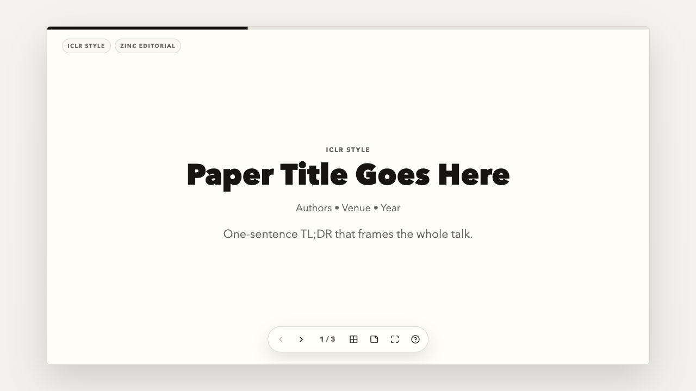

# Slider

Turn research papers into evidence-backed browser presentations.

Slider is an agent skill for creating, revising, and auditing paper talks. Give it a PDF, arXiv link, DOI, title, or extracted text plus your audience and time limit. It helps build a coherent argument with traceable figures, results, and limitations.



## Install and use

For Codex, install the complete folder in your project's skill directory:

```bash
mkdir -p .agents/skills
git clone https://github.com/voidful/Slider.git .agents/skills/slider
```

For personal use across projects, use `~/.agents/skills/slider` instead. Keep `scripts/`, `references/`, `assets/`, and `agents/` together with `SKILL.md`. Codex discovers these locations as described in the [official skill documentation](https://learn.chatgpt.com/docs/build-skills).

Then ask:

```text
$slider Turn the attached paper into a 10-minute conference talk for ML
researchers. Include the key method figure, the main comparison, limitations,
and speaker notes. Build the HTML, inspect it, and fix rendering problems.
```

You can also give a precise brief or limit the work:

```text
$slider 將這篇論文做成 6 張、5 分鐘的繁體中文簡報，保留核心圖表與講者備註。
$slider Fix the wording on slide 4 and check that it still fits.
$slider Audit this deck against the paper without editing it.
$slider Plan an eight-slide talk; stop at the outline and evidence mapping.
```

The requested audience, language, duration, slide count, and format take precedence over workflow/style defaults. With no brief, Slider assumes a research audience and roughly 15 minutes. There is no minimum slide count. Ordinary paper summaries and general website work do not need this skill.

## What it produces

| Deliverable | When to use it |
|:---|:---|
| HTML deck | Default: one browser-openable file with presentation and editor controls |
| React component | Integrate slides into an existing application |
| Vite React project | Develop a reusable deck with separate content, components, and presenter tooling |
| Talk plan | Review the argument, pacing, and evidence before building |
| Audit findings | Locate unsupported claims, missing evidence, or rendering problems |

The bundled renderer implements HTML and React targets. It does not export native editable PPTX. If you request another format, the agent needs appropriate tooling and should report any unsupported step.

## What guides the work

- **Traceable evidence:** source figures, tables, equations, exact comparisons, and limitations drive the talk. Crops and faithful redraws retain source references.
- **Readable slides:** one main message per slide, legible evidence, and a fixed 1200×675 stage that scales consistently into fullscreen.
- **Task-sized workflows:** a new deck uses source selection, planning, rendering, and verification; a wording fix reuses the existing plan and assets.
- **Relevant checks:** the agent completes the requested artifact and corrects observed defects, reporting checks that passed or could not run.
- **Authored wording:** titles state claims, and zh-TW and English copy follows [slide copy rules](references/slide-copy-rules.md) adapted from [Michelin](https://github.com/voidful/michelin); `scripts/audit_slide_copy.py` and the deck's Guide flag what to reread.
- **Guided when asked:** to build a talk together, the agent asks one question at a time and reports an honest status, following the [guided deck workflow](references/guided-deck-workflow.md) adapted from [life-design-compass](https://github.com/voidful/life-design-compass).

The short [SKILL.md](SKILL.md) routes to [task workflows](references/task-workflows.md) and specialized references as needed. The Python helpers provide repeatable transformations; their generated text, crop selection, and confidence scores still need review against the paper.

## Preview the bundled starters

Open [the HTML starter](assets/html-slideshow-starter/paper-presentation.html) locally in a browser, or run the React demo:

```bash
cd assets/react-project-starter
npm ci
npm run dev
```

The HTML starter includes keyboard navigation, a presenter window with the next build, notes, and a paced timer, an overview of real thumbnails, a Ctrl/⌘ K command menu, deep links, print to PDF (one page per slide or a notes handout), fullscreen, and a structured editor with thumbnails, reordering, text/block editing, undo/redo, drafts, and JSON/HTML export. Its editor adds a Guide that walks the deck to `ready to present` one step at a time, comment mode with an agent export, and image drop onto figure slots. The React project adds a linked presenter window, visual asset review, review comments, design settings, and static/PDF export scripts.

The HTML deck, React project, and single-file React component animate slide transitions and text, figure, and number entrances with [motion presets](references/motion-graphics.md). Choose `editorial` (default), `subtle`, `kinetic`, `cinematic`, `digital`, or `none`; the `morph` transition flies shared figures, metrics, and titles between slides. Every effect ends on the static layout, and pressing next finishes it at once. Set the preset in the slide plan's `meta.motion` or with `--motion`, or change it live: `M` in the HTML deck and React component, Tweaks (`T`) in the React project.

Common controls include Left/Right or Space to advance, `O` for overview, `N` for notes, `P` for the presenter window, and `F` for fullscreen; the HTML deck moves auto-advance to `A`. Progressive builds reveal content before moving to the next slide. Use `?` for the current renderer's shortcut list; press `E` in the HTML deck to edit and `G` there for the Guide.

## Use the helpers directly

Run these commands from a checkout of Slider. Python 3.10+ is needed for the helpers; PDF extraction/cropping also needs PyMuPDF. The browser audit needs a discoverable Chromium/Chrome executable. The React starter uses Node.js and its package-lock dependencies.

```bash
python3 -m pip install PyMuPDF  # only for PDF processing
```

For a paper-to-plan starting point:

```bash
python3 scripts/extract_paper_evidence.py paper.pdf --output evidence.json
python3 scripts/find_visual_evidence.py paper.pdf --output visuals.json
python3 scripts/generate_slide_data.py \
  --evidence evidence.json --visuals visuals.json --mode json --output slide-plan.json
```

This is a draft scaffold. Inspect and edit the claims, order, length, and evidence bindings. The generator currently seeds a long talk and has no duration or slide-count option; an agent can author or revise the JSON directly. See the [workflow guide](references/task-workflows.md) for scoring, cropping, and binding figures.

Render a prepared plan:

```bash
python3 scripts/render_slideshow_artifact.py \
  --slide-data slide-plan.json --mode html --output deck.html
```

Or build a React project:

```bash
python3 scripts/render_slideshow_artifact.py \
  --slide-data slide-plan.json --mode react-project --output deck-project
cd deck-project
npm ci
npm run dev
```

An optional `--deck-design deck_design.json` supplies design settings to the React project. Use each helper's `--help` for its supported arguments.

## Single-file and offline delivery

For a portable HTML deck, embed paper images as data URIs; the renderer does not automatically embed local image paths.

The default template still references KaTeX and phone/QR libraries. A single HTML file is therefore not a guarantee of offline operation. `python3 scripts/offline_katex.py deck.html` creates `deck_offline.html` with math resources bundled, but phone pairing still needs network services and a reachable HTTP(S) URL. Check the final file without network access before calling a talk offline-ready. See [output contracts](references/output-contracts.md).

If a paper, figure, runtime, or browser is unavailable, Slider should identify the missing evidence/check and deliver only the supported plan or draft. It should not invent results or describe skipped verification as passed.

## Verification and development

| Check | Command | What it establishes |
|:---|:---|:---|
| Bundle metadata | `python3 scripts/export_platform_configs.py --platform all --validate` | Required instructions and referenced knowledge files resolve |
| Export regressions | `python3 scripts/test_platform_exports.py` | Separate portable bundles, usable paths, omitted generated dependencies |
| Repository health | `python3 scripts/check_skill_health.py` | Syntax, references, and synthetic pipeline/artifact integration |
| Evidence heuristics | `python3 scripts/audit_research_slides.py --slide-data slide-plan.json --paper-type architecture-heavy` | Potential source/visual/density issues; use the paper's actual type |
| Browser geometry | `python3 scripts/browser_slide_audit.py deck.html` | Windowed and simulated-fullscreen overflow/image checks |

The HTML renderer already attempts static and browser checks. Reuse its results instead of repeating the same check on unchanged output. Scientific fidelity still requires reviewing the paper; simulated fullscreen does not establish native fullscreen, projector readability, or real phone pairing.

See [TEST_MATRIX.md](TEST_MATRIX.md) for applicable checks and [verification workflow](references/verification-workflow.md) for completion criteria. Synthetic integration tests are not an independent evaluation of an agent-generated research talk.

## Other agent platforms

| Platform | Instructions |
|:---|:---|
| Codex | [SKILL.md](SKILL.md) plus [agents/openai.yaml](agents/openai.yaml) |
| Gemini CLI / file-based hosts | Complete skill folder and [SKILL.md](SKILL.md) |
| ChatGPT Custom GPT | [Concise prompt](agents/chatgpt/system_prompt.md) and selected knowledge files |
| Claude Projects / Claude Code | [Claude instructions](agents/claude/CLAUDE.md) |
| OpenAI integrations | [Handoff metadata](agents/openai/config.yaml), pointing to the shared skill |

```bash
python3 scripts/export_platform_configs.py --platform all --export-dir dist/platforms
```

Exports keep runtime resources and relative paths, with one directory per platform. Per-platform `config.yaml` files describe this repository's bundles; they are not an API/SDK configuration schema. Current tool and upload capabilities determine what each host can actually execute. See [platform adaptation](references/platform-adaptation-guide.md).

## Design and instruction sources

The instruction cleanup draws on [Eric Provencher's article](https://x.com/pvncher/status/2095991462416490862) and [OpenAI's GPT-6 Astra guidance](https://developers.openai.com/api/docs/guides/latest-model?model=gpt-6-astra), reviewed on 2026-09-07. The resulting skill uses concise discovery, selective reference loading, clear scope, and proportionate verification. These sources inform the workflow; they do not imply a model-specific benchmark or required model.

Slider also adapts selected presenter/editor ideas from [1weiho/open-slide](https://github.com/1weiho/open-slide) (commit review 2026-08-18; v2.3.1 site review 2026-10-29). What was adopted, extended, or declined, and why, is recorded in [open-slide adoption](references/open-slide-adoption.md). Wording rules adapt [voidful/michelin](https://github.com/voidful/michelin), and the guided interview adapts [voidful/life-design-compass](https://github.com/voidful/life-design-compass).

For implementation details, use the [reference index](references/README.md), [architecture](ARCHITECTURE.md), [maintenance notes](references/skill-maintenance.md), and [changelog](CHANGELOG.md).
